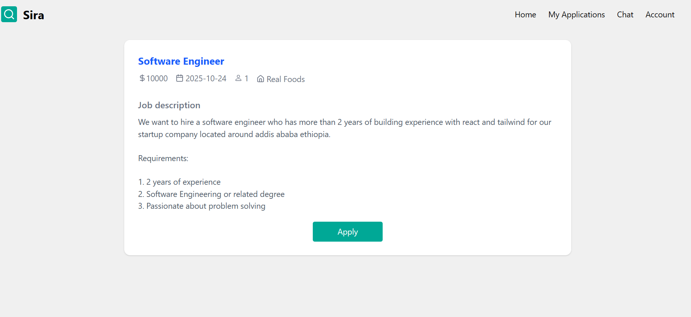

# Job Application (React + Vite)

This repository is a job-posting and application front-end built with React and Vite. It provides an interface for companies, agents, and admins to post jobs, manage applications, chat, and administer users.

## Highlights

- Job posting and application flows (create, update, delete)
- Role-based layouts for Admin / Company / Agent
- Chat support between users
- File uploads (CVs, profile pictures)
- Auth with access/refresh token handling

## Tech stack

- React (Vite)
- Tailwind CSS
- Fetch-based API service layer (singleton `apiService`)

## Local setup

1. Install dependencies

```bash
npm install
```

2. Run development server

```bash
npm run dev
```

## Screenshots

Below are screenshots captured from the app

<div style="display:grid;grid-template-columns:repeat(auto-fit,minmax(220px,1fr));gap:12px;align-items:start">
	<figure style="margin:0">
			<a href="src/assets/screenshot1.png" target="_blank"></a>
			<figcaption style="font-size:12px;color:#555;margin-top:6px">Landing</figcaption>
	</figure>
	<figure style="margin:0">
			<a href="src/assets/screenshot2.png" target="_blank"></a>
			<figcaption style="font-size:12px;color:#555;margin-top:6px">Landing</figcaption>
	</figure>
	<figure style="margin:0">
			<a href="src/assets/screenshot3.png" target="_blank"></a>
			<figcaption style="font-size:12px;color:#555;margin-top:6px">Login</figcaption>
	</figure>
	<figure style="margin:0">
			<a href="src/assets/screenshot4.png" target="_blank"></a>
			<figcaption style="font-size:12px;color:#555;margin-top:6px">Register</figcaption>
	</figure>
	<figure style="margin:0">
			<a href="src/assets/screenshot5.png" target="_blank"></a>
			<figcaption style="font-size:12px;color:#555;margin-top:6px">Create  job post</figcaption>
	</figure>
	<figure style="margin:0">
			<a href="src/assets/screenshot6.png" target="_blank"></a>
			<figcaption style="font-size:12px;color:#555;margin-top:6px">Find job posts</figcaption>
	</figure>
	<figure style="margin:0">
		<a href="src/assets/Screenshot7.png" target="_blank"></a>
		<figcaption style="font-size:12px;color:#555;margin-top:6px">Account page</figcaption>
	</figure>
	<figure style="margin:0">
		<a href="src/assets/Screenshot8.png" target="_blank"></a>
		<figcaption style="font-size:12px;color:#555;margin-top:6px">Jobs page</figcaption>
	</figure>
	<figure style="margin:0">
		<a href="src/assets/Screenshot9.png" target="_blank"></a>
		<figcaption style="font-size:12px;color:#555;margin-top:6px">Apply page</figcaption>
	</figure>
	<figure style="margin:0">
		<a href="src/assets/Screenshot10.png" target="_blank"></a>
		<figcaption style="font-size:12px;color:#555;margin-top:6px">Apply page</figcaption>
	</figure>
	<figure style="margin:0">
		<a href="src/assets/Screenshot11.png" target="_blank"></a>
		<figcaption style="font-size:12px;color:#555;margin-top:6px">Review application page</figcaption>
	</figure>
	<figure style="margin:0">
		<a href="src/assets/Screenshot12.png" target="_blank"></a>
		<figcaption style="font-size:12px;color:#555;margin-top:6px">Review application page</figcaption>
	</figure>
	<figure style="margin:0">
		<a href="src/assets/Screenshot13.png" target="_blank"></a>
		<figcaption style="font-size:12px;color:#555;margin-top:6px">Companies recieved application page</figcaption>
	</figure>
	<figure style="margin:0">
		<a href="src/assets/Screenshot14.png" target="_blank"></a>
		<figcaption style="font-size:12px;color:#555;margin-top:6px">Chat page</figcaption>
	</figure>
</div>
